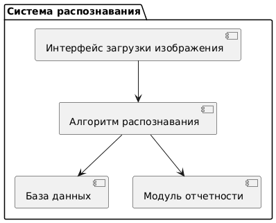
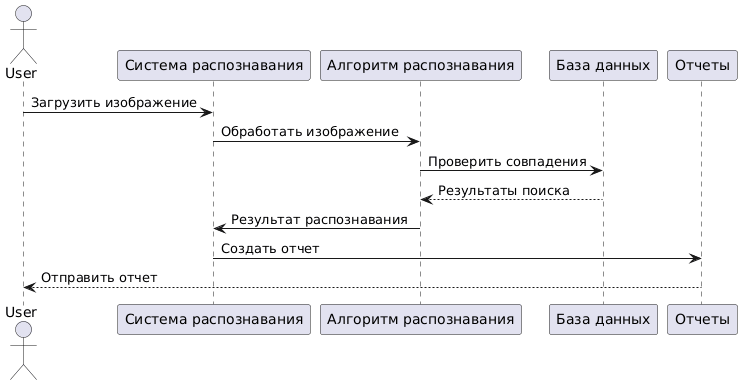
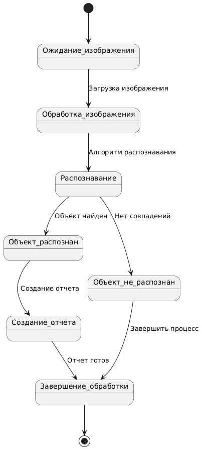

# Диаграмма активностей

# Диаграмма классов

# Диаграмма компонентов

# Диаграмма развертывания

# Диаграмма объектов

# Диаграмма последовательностей

# Диаграмма состояний

# Диаграмма Use case

